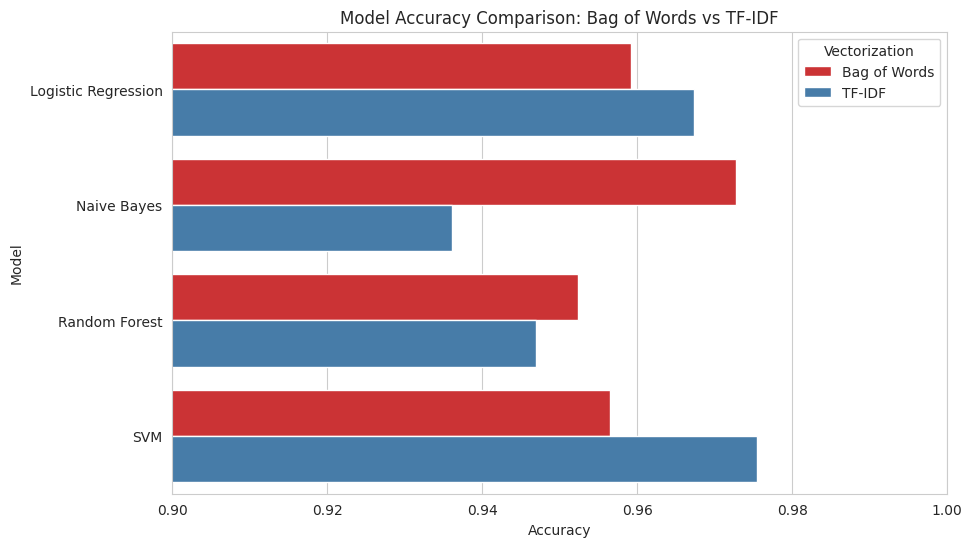

# 📰 BBC News Classification using NLP and Machine Learning

---

## 📌 Overview

This project builds an end-to-end Natural Language Processing (NLP) and machine learning pipeline to classify BBC news articles into different news categories.

The project demonstrates a complete text classification workflow, including text vectorization, model training, evaluation, and comparison of multiple machine learning algorithms using two different feature extraction techniques: Bag of Words and TF-IDF.

---

## 📂 Dataset

**Source:** Kaggle - BBC News Classification Dataset

https://www.kaggle.com/datasets/yufengdev/bbc-fulltext-and-category

The dataset consists of **2,225 BBC news articles** categorized into five different classes:

- Business
- Entertainment
- Politics
- Sport
- Tech

Each record contains:

- **Category** → News category (Target Variable)
- **Text** → Full news article

This is a multiclass text classification dataset commonly used for Natural Language Processing (NLP) tasks.

---

## 🎯 Objective

The objective of this project is to build machine learning models capable of automatically classifying BBC news articles into their respective categories and compare the performance of different NLP feature extraction techniques and classification algorithms.

---

## 🛠️ Technologies Used

- Python
- Pandas
- NumPy
- Matplotlib
- Seaborn
- Scikit-learn

---

## 📊 Project Workflow

The project follows an end-to-end NLP workflow:

- Data Loading
- Data Inspection
- Train-Test Split
- Text Vectorization using Bag of Words
- Model Training
- Model Evaluation
- Text Vectorization using TF-IDF
- Model Retraining
- Model Evaluation
- Performance Comparison
- Prediction on Unseen News Articles

---

## 🔍 Data Preprocessing

The following preprocessing steps were performed:

- Loaded and inspected the dataset
- Split the dataset into training and testing sets
- Converted text into numerical features using **CountVectorizer (Bag of Words)**
- Converted text into numerical features using **TF-IDF Vectorizer**
- Prevented data leakage by fitting vectorizers only on the training data
- Transformed unseen test data using the fitted vectorizers

---

## 🤖 Machine Learning Models

The following classification algorithms were trained and evaluated:

- Logistic Regression
- Multinomial Naive Bayes
- Random Forest Classifier
- Linear Support Vector Machine (SVM)

Each model was trained and evaluated using both:

- Bag of Words
- TF-IDF

---

## 📈 Model Evaluation

Models were evaluated using:

- Accuracy Score
- Classification Report
- Performance Comparison Charts

The performance of all models was compared to identify the most effective approach for BBC news classification.

---

## ✅ Results

- Built a complete NLP and machine learning pipeline for multiclass news classification.
- Implemented two text vectorization techniques: Bag of Words and TF-IDF.
- Trained and compared four different machine learning classifiers.
- Evaluated model performance using accuracy and classification reports.
- Compared the effectiveness of different feature extraction techniques and machine learning models for text classification.

 

